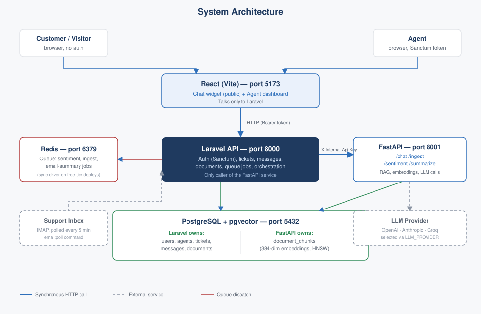

# AI Customer Support Platform


An enterprise-style AI-powered customer support platform combining a **Laravel** backend for business logic and ticketing, a **FastAPI** microservice for AI/RAG operations, and a **React** frontend for both the customer chat widget and the admin dashboard — backed by a shared **PostgreSQL** database (with `pgvector`) and a pluggable LLM layer (**OpenAI**, **Anthropic**, or **Groq**).

Built as a portfolio piece to demonstrate polyglot microservice architecture, applied AI (RAG, sentiment analysis, summarization), clean API design, and enterprise development practices (auth, async queues, testing, deployment).

## Live demo

**https://ai-customer-support-platform-mu.vercel.app/**

The homepage and chat widget are open to anyone — try asking about order tracking, returns, refunds, shipping, or payment methods. The agent dashboard (`/login`) is gated behind a seeded admin account; see the maintainer for demo credentials rather than a public login being listed here.

> Both backend services run on a free-tier host that spins down after 15 minutes of inactivity — the first request after a while (a chat message, or a dashboard login) can take 15–30+ seconds while it wakes back up. Everything after that is fast.

## Features

- **RAG-grounded chat** — every reply is built from chunks of real, ingested documents (pgvector cosine-similarity retrieval), not the model improvising.
- **Confidence-based escalation** — when retrieval finds nothing relevant, or the best match is still too weak, the ticket is automatically flagged for a human agent instead of guessing.
- **Multi-provider LLM support** — OpenAI, Anthropic, or Groq, swapped with one environment variable (`LLM_PROVIDER`) via a strategy pattern; no code changes to switch.
- **Sentiment-aware triage** — every customer message is scored, and each ticket rolls up to its worst-case sentiment so frustrated customers surface first in the queue.
- **Email-to-ticket automation** — a support inbox is polled on a schedule; new emails become tickets with an AI-generated summary attached.
- **Admin dashboard** — a real-time ticket queue with status/priority/sentiment filters, a full reply/resolve flow, role-based visibility (non-admin agents only see unassigned or their own tickets), and a Documents page for managing the chatbot's knowledge base (upload, list, and view ingested content).

## Tech Stack

| Layer | Stack |
|---|---|
| Backend (business logic) | Laravel 12, PHP 8.2+, Sanctum, Redis-backed queues |
| AI microservice | FastAPI, Python 3.11+, SQLAlchemy + Alembic, pgvector, psycopg2, sentence-transformers |
| Frontend | React 19 + Vite 8 + TypeScript, axios, react-router-dom — no UI library, hand-rolled design system |
| Database | PostgreSQL 16 (`pgvector/pgvector:pg16` locally, [Neon](https://neon.tech) in production) with the `pgvector` extension |
| Queue / cache | Redis (local dev; production runs jobs synchronously instead — see [docs/architecture.md](docs/architecture.md)) |
| AI provider | Pluggable via `LLM_PROVIDER` — OpenAI, Anthropic, or Groq (strategy pattern in `app/services/llm/`); Groq's free tier is the default for local dev. Embeddings via local `sentence-transformers` (`all-MiniLM-L6-v2`) |

## Architecture

React talks only to Laravel; Laravel is the only caller of FastAPI, authenticated with a shared-secret header. One Postgres instance, two schema owners. Full write-up, diagrams, and the exact request/response flow for a chat message: **[docs/architecture.md](docs/architecture.md)**.



## API Reference

Generated from the actual routes and Pydantic/FormRequest schemas, not written ahead of the code:

- **[Laravel API](docs/api-spec/laravel-api.md)** — auth, tickets, messages, documents, chat
- **[FastAPI service](docs/api-spec/fastapi-service.md)** — chat, ingest, sentiment, summarize, health

## Repository Structure

```
ai-customer-support-platform/
├── CLAUDE.md                 # full architecture rules, data flows, schema, session-by-session progress log
├── docker-compose.yml        # local Postgres (pgvector) + Redis
├── docs/
│   ├── architecture.md       # written architecture overview
│   ├── architecture/         # system + RAG-flow diagrams (SVG)
│   └── api-spec/             # Laravel + FastAPI endpoint reference
├── backend-laravel/          # auth, tickets, orchestration, queue jobs
├── ai-service-fastapi/       # chat/RAG, ingest, sentiment, summarize endpoints
├── frontend-react/           # chat widget + admin dashboard
└── scripts/setup.sh          # placeholder — not currently used; follow "Local Setup" below
```

## Prerequisites

- PHP 8.2+, Composer
- Python 3.11+
- Node.js `^20.19.0` or `>=22.12.0` (required by Vite 8 — plain "Node 18" is not enough)
- Docker (for Postgres + Redis via `docker-compose.yml`)
- An API key for at least one supported LLM provider (OpenAI, Anthropic, or Groq — Groq offers a free tier, easiest for local dev)

## Local Setup

**1. Start Postgres and Redis:**

```bash
docker compose up -d
```

**2. Enable pgvector** (once per database):

```sql
CREATE EXTENSION IF NOT EXISTS vector;
```

**3. Laravel backend:**

```bash
cd backend-laravel
composer install
cp .env.example .env   # set DB_*, REDIS_*, AI_SERVICE_URL, AI_SERVICE_SECRET
php artisan key:generate
php artisan migrate
php artisan db:seed --class=AgentSeeder   # creates admin@example.com / password for /login
php artisan serve       # http://localhost:8000
php artisan queue:work  # in a separate terminal — required for sentiment/ingest jobs to actually run locally
```

**4. FastAPI AI service:**

```bash
cd ai-service-fastapi
python -m venv venv && source venv/bin/activate   # or venv\Scripts\activate on Windows
pip install -r requirements.txt
cp .env.example .env   # set LLM_PROVIDER (openai|anthropic|groq) + that provider's API key/model, INTERNAL_API_KEY (must match Laravel's AI_SERVICE_SECRET), DATABASE_URL
alembic upgrade head    # creates document_chunks + its HNSW index
uvicorn app.main:app --reload --port 8001
```

**5. React frontend:**

```bash
cd frontend-react
npm install
cp .env.example .env   # set VITE_API_BASE_URL, e.g. http://localhost:8000/api
npm run dev             # http://localhost:5173
```

Log into the dashboard at `http://localhost:5173/login` with `admin@example.com` / `password` (the seeded local dev account — never used in production).

## Testing

```bash
# Laravel (39 tests)
cd backend-laravel && php artisan test

# FastAPI (26 tests)
cd ai-service-fastapi && pytest

# Frontend — type-check + production build (clean), then lint
cd frontend-react && npm run build && npm run lint
```

`npm run lint` currently exits non-zero — 3 pre-existing `react-hooks/set-state-in-effect` errors in `TicketListPage.tsx`/`TicketDetailPage.tsx`, left as-is rather than fixed as a drive-by change unrelated to whatever session touched those files last. `npm run build` (which is what CI/deploys actually depend on) is clean.

## Deployment

All three services are live (see [Live demo](#live-demo) above):

- **React** → Vercel, deployed from this repo's `frontend-react/` directory, `VITE_API_BASE_URL` pointing at the live Laravel API.
- **Laravel** → Render, as a Docker web service (see `backend-laravel/Dockerfile`), against a managed Postgres instance.
- **FastAPI** → Render, also Docker, same Postgres instance (pgvector-enabled), CPU-only PyTorch build to keep the image size reasonable on a free tier.
- **Postgres** → [Neon](https://neon.tech), the one database both backend services share.

Production deliberately differs from local dev in two ways, both driven by staying on genuinely free infrastructure end-to-end: queued jobs run synchronously (`QUEUE_CONNECTION=sync`) rather than through a Redis-backed worker, since Render's free tier has no background-worker option; and document uploads are currently gated behind a reversible kill-switch (`DOCUMENT_UPLOADS_ENABLED`) at both the frontend and the API level. Full reasoning for both in [CLAUDE.md](CLAUDE.md).

## License

No license has been chosen yet for this repository.

---

For the complete architecture rules, every data flow, the full database schema, and a detailed session-by-session build log (what was built, what deviated from plan, and why), see **[CLAUDE.md](CLAUDE.md)**.
