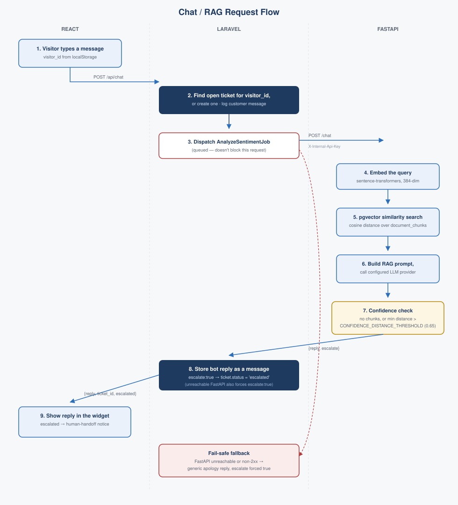

# Architecture

## Overview

Three services, one shared PostgreSQL database, communicating in one direction only:

- **React** (chat widget + admin dashboard) talks only to **Laravel**. It never calls FastAPI directly — this keeps a single, clean public API surface.
- **Laravel** owns auth, tickets, messages, documents, and all orchestration. It's the only caller of **FastAPI**, and every call carries a shared-secret header (`X-Internal-Api-Key`) that proves the request came from Laravel — not user-facing auth, just service-to-service trust.
- **FastAPI** owns the AI/RAG surface: chat completion, document ingestion, sentiment analysis, and summarization. It never talks back to Laravel.
- **PostgreSQL** (with the `pgvector` extension) is one physical database with two schema owners: Laravel's Eloquent migrations own `users`, `agents`, `tickets`, `messages`, `documents`; FastAPI's SQLAlchemy models own `document_chunks` (the embeddings table). Neither service migrates the other's tables.
- **Redis** backs Laravel's queue (`AnalyzeSentimentJob`, `IngestDocumentJob`, `SummarizeEmailJob`) in local development. In production, `QUEUE_CONNECTION=sync` instead — no worker process is deployed (Render's free tier has no free background-worker option), so queued jobs run inline in the same request rather than being handed off. Same code, same jobs, just no queue in between; see [CLAUDE.md](../CLAUDE.md) for the full reasoning.

## Request flows

**Chat / RAG** — the core flow, diagrammed in full below: a visitor's message goes widget → Laravel (find-or-create ticket, log message, dispatch a sentiment job) → FastAPI (embed the query, pgvector similarity search, build a RAG prompt, call the configured LLM provider, decide `escalate` from retrieval confidence) → back through Laravel (store the bot reply, flip ticket status if escalated) → widget (show the reply, or a human-handoff notice).

**Document ingestion** — an admin uploads a `.txt`/`.md` file on the dashboard's Documents page → Laravel stores the file's content (in the database, not just on disk — see below) and dispatches `IngestDocumentJob` → the job calls FastAPI's `/ingest`, which chunks the text, embeds each chunk, and writes rows into `document_chunks`. A failed ingest call throws, landing the job in `failed_jobs` rather than silently succeeding.

**Email-to-ticket** — a scheduled command (`email:poll`, every 5 minutes) polls a support inbox over IMAP, and for each unseen message creates a new ticket + customer message, dispatches both a summarization job and a sentiment job, then marks the email seen — only after the ticket/message are safely created, so a mid-poll failure leaves the email for retry rather than losing it.

## A deliberate deviation from "ephemeral disk"

Uploaded documents are always small (≤5MB) plain text — `StoreDocumentRequest` only accepts `.txt`/`.md`. Laravel still writes the file to its local storage disk on upload, but production's actual persistence for the "View document" feature comes from a `content` column on `documents` itself, populated at upload time. This exists because Render's free-tier web service has an ephemeral filesystem — the local disk is wiped on every redeploy — so a file-only approach silently lost every uploaded document's viewable content within hours in practice. Storing the (small, always-text) content directly in Postgres sidesteps that without needing an external object store.

## What's real vs. not yet wired up

A few things worth knowing before reading the API reference docs:

- `POST /tickets` and `DELETE /tickets/{id}` are routed (part of Laravel's `apiResource`) but their controller methods are empty stubs — they respond `200` with nothing. Tickets are only ever created through the chat flow or the email poller.
- `DocumentController@update`/`@destroy` exist as methods but have **no route at all** registered for them.
- `POST /login` has no rate limiting applied, unlike every other authenticated route.
- FastAPI's `/sentiment` and `/summarize` have no rate limiting; `/chat` and `/ingest` do (100/min, per IP).
